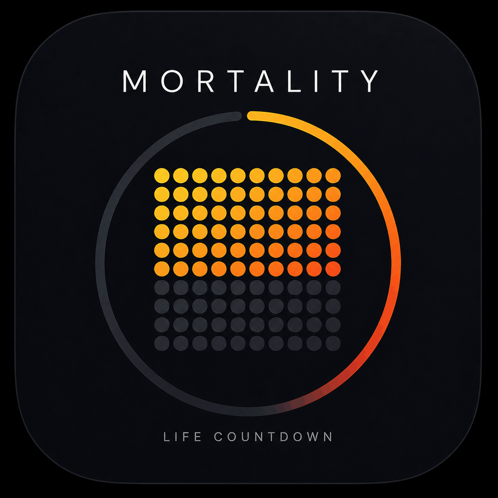

  

  
  
  
    

  
  

<dev>

</dev>

# Mortality - Life Countdown 

    

A simple Firefox extension that replaces your new tab page with a visual reminder of life's finite nature.

## Installation

  

## Features

- **Life Grid**: Displays your life as a colorful grid of dots, where each dot represents a week, month, or year
- **Life Countdown Timer**: Shows time remaining based on your date of birth and life expectancy
- **Customizable Settings**:
  - Date of birth and life expectancy
  - Dot size and shape (square/circle)
  - Timer font size and styling
  - Timer precision (years to milliseconds)
  - Transparent timer background option

## License

Copyright 2026 Fady Nagh

Licensed under the [MIT License](https://opensource.org/licenses/MIT).

## Acknowledgements

Thanks to [This Chrome extension](https://chromewebstore.google.com/detail/Mortality%20-%20Death%20Clock%20-%20New%20Tab/eeedcpdcehnikgkhbobmkjcipjhlbmpn) for inspiration.
